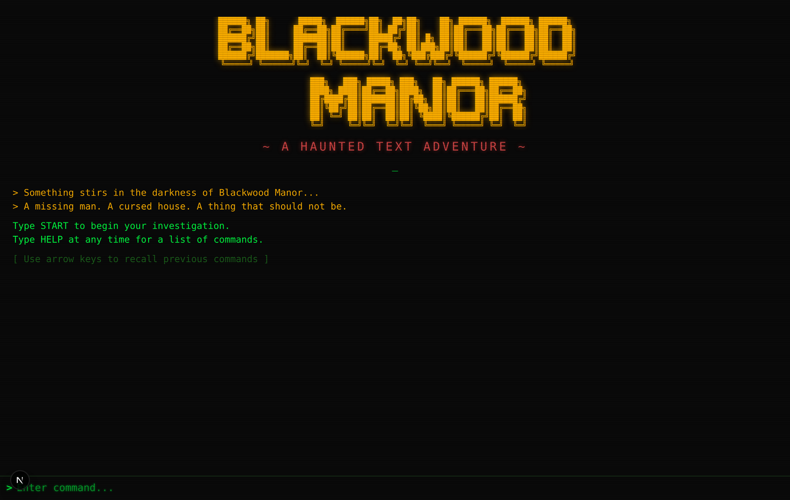
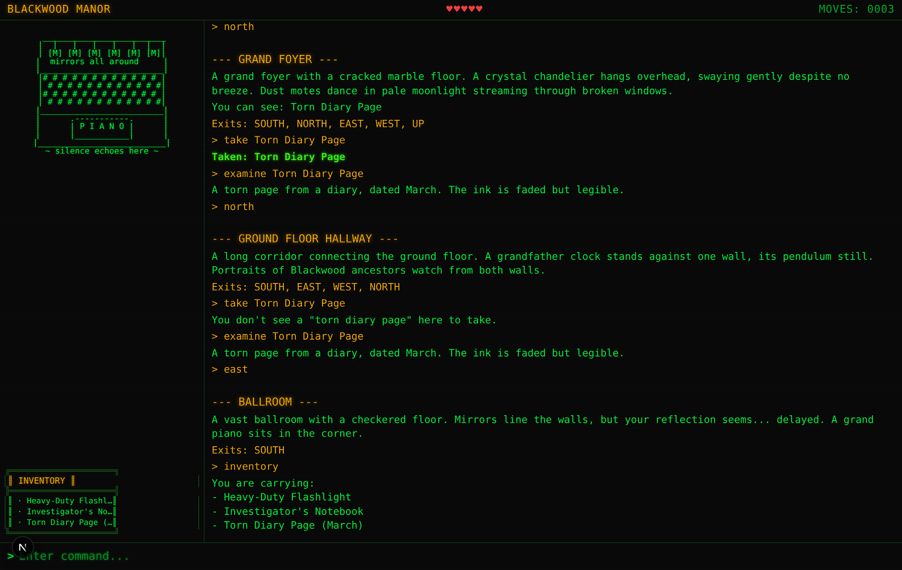
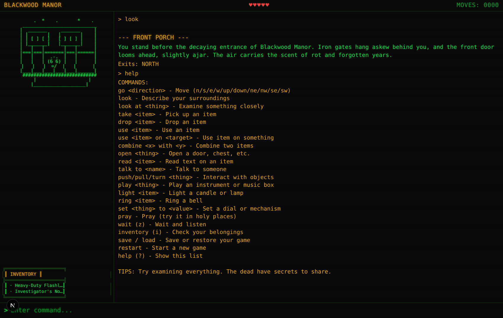

# Blackwood Manor

A haunted-house text adventure that runs in the browser. A missing man, a cursed house, and 33 rooms that each get their own hand-drawn ASCII scene.

Type `START` to begin, `HELP` for the verb list, and `EXAMINE` everything.

Next.js 16, React 19, TypeScript. No game engine, no libraries beyond the framework.

---

## What it looks like



The play view. Room art on the left changes with every room, inventory tracks below it, health and move count across the top. Rooms report their own exits, and taking something updates the panel immediately.



`HELP` at any time. This is the whole verb set.



---

## The parser

The interesting part of a text adventure is that the player types whatever they want and the game has to cope.

`engine/parser.ts` normalizes input into a `{ verb, noun, preposition, target }` shape before any game logic runs. It strips articles (`the`, `a`, `an`, `some`), maps **75 verb aliases** down to a canonical set, and handles direction shorthand, so all of these do the same thing:

```
go north      north      n
look at the painting      examine painting      inspect painting
take the rusty key        grab rusty key        pick up rusty key
```

Prepositions are parsed rather than ignored, which is what makes two-object commands work:

```
use crowbar on floorboards
combine locket with chain
set dial to 1847
```

Unknown input fails in-character rather than crashing. `take lantern` in a room with no lantern answers `You don't see a "lantern" here to take.`

## How the world is described

Rooms, items and events are data, not code. `engine/types.ts` defines the shapes and `data/` holds the content, so adding a room means adding an object, never touching the engine.

An exit can be locked, can require a specific item, can require a flag to be set, or can be hidden until something reveals it:

```ts
{ direction: 'north', roomId: 'library', locked: true,
  requiredItem: 'brass-key', lockMessage: 'The door will not budge.' }
```

Items can act alone or on a target, set flags, consume themselves, hand you something else, teleport you, or hurt you. Rooms fire events on entry that can be conditional and can be marked `once` so they never repeat.

The current build has **33 rooms, 24 items, 19 world flags, 4 NPCs with conditional dialogue, 11 hidden objects and 3 dark rooms** you need a light source to survive.

## Layout

```
engine/
  parser.ts       text -> { verb, noun, preposition, target }
  commands.ts     one handler per verb, 613 lines
  gameState.ts    reducer over a GameAction union
  events.ts       room entry events, once-firing
  types.ts        the whole data model
data/
  rooms.ts        33 rooms, exits, items, NPCs
  items.ts        24 items and their interactions
  art.ts          33 ASCII scenes, one per room, plus a fallback
components/       GameScreen, TextOutput, CommandInput, ArtPanel, Inventory, StatusBar
hooks/
  useGame.ts      dispatches parsed commands into the reducer
  useCommandHistory.ts   arrow-key recall
```

State is a single `GameState` object moved by a reducer over a typed `GameAction` union, which is what makes `save` one line: serialize the state. `load` is longer, because a save file is the one input the engine did not produce itself — it can be stale, hand-edited, or written by an older build — so it gets checked field by field before the reducer is allowed anywhere near it.

## Running it

```bash
npm install
npm run dev
```

Open http://localhost:3000.

## Running the tests

```bash
npm test          # once
npm run test:watch
npm run test:e2e  # the playthrough, in a real browser
```

348 Vitest tests over the engine, the world data and the interface: the
parser's aliases and preposition handling, the reducer, room entry events,
every command handler against a fixture world, the rules that live only in
`useGame` (the safe combination, the portrait order, winding the music box),
saving and loading through `localStorage`, arrow-key recall, and every
component from the status bar to the title screen.

The integrity checks over `data/` are the ones that catch content mistakes:
every exit leads to a real room, every locked exit can be opened, every
granted item exists, every room has its own art panel and no panel is
orphaned, and every flag something waits on is one that something else can
set.

`e2e/playthrough.spec.ts` then plays the game in a real browser, START to the
banishment, about seventy typed commands. The unit tests can tell you the
engine still works; only this can tell you the world data still threads
together into a game that can be won.

CI runs `lint`, `typecheck`, `test`, `build` and the playthrough on every
pull request.

## License

Source-available for reading and evaluation. See `LICENSE`. Not open source.
